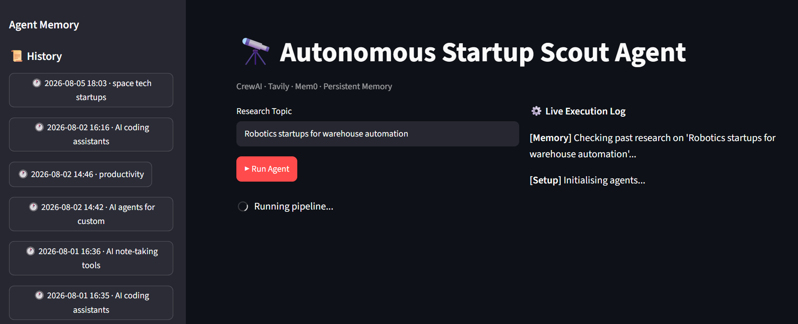
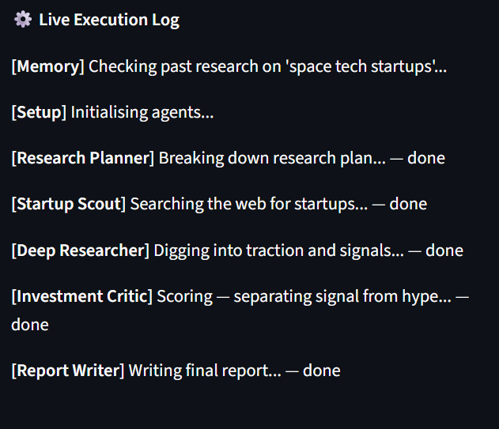
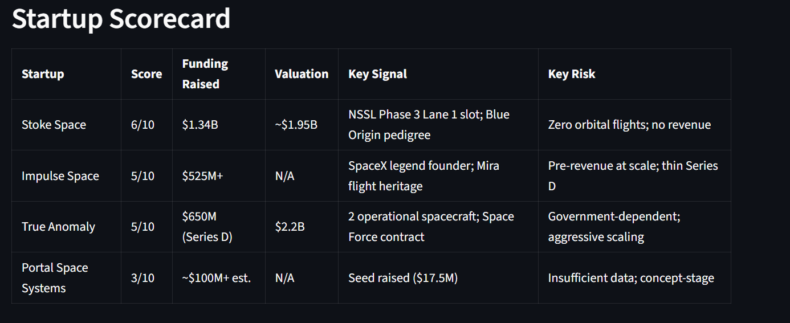
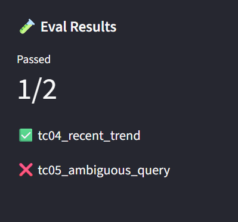
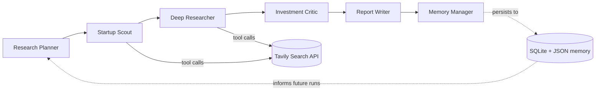

# 🔭 ScoutAgent — Autonomous Startup Scout

**A multi-agent AI pipeline that researches an entire startup landscape end-to-end — planning, searching, analyzing, scoring, and reporting — with zero human intervention between steps.**

Built to explore agent orchestration, tool-use, persistent memory, and evaluation design for production-style LLM systems.


---

## Table of Contents

- [What it does](#what-it-does)
- [Demo](#demo)
- [Architecture](#architecture)
- [Why this project](#why-this-project)
- [Tech stack](#tech-stack)
- [Getting started](#getting-started)
- [Evaluation & testing](#evaluation--testing)
- [Engineering decisions & known limitations](#engineering-decisions--known-limitations)
- [Project structure](#project-structure)
- [Roadmap](#roadmap)

---

## What it does

Give ScoutAgent a topic — *"AI coding assistants," "climate tech startups," "AI agents for customer support"* — and six specialized agents work in sequence to turn it into an investment-analyst-grade report:

1. **Plan** the research strategy (queries, categories, scoring criteria)
2. **Search** the live web for 5–8 relevant startups
3. **Research** each one deeply (funding, team, social proof, competitors, red flags)
4. **Score** every startup 1–10 with reasoning, flagging hype vs. signal
5. **Write** a scannable markdown report (Executive Summary → Scorecard → Top Picks → Next Actions)
6. **Remember** — persist a structured summary so future runs on related topics build on what's already known

No single LLM call does this. It's an orchestrated pipeline where each agent's output becomes the next agent's context.

## Demo

### 🚀 Application Overview

<p align="center">
  
</p>

ScoutAgent provides an end-to-end research workflow where specialized AI agents collaboratively discover, analyze, score, and report on startup ecosystems while maintaining persistent memory across runs.

---

### ⚙️ Multi-Agent Execution & Generated Report

<table>
<tr>
<td align="center" width="50%">

**Live Execution Log**



</td>

<td align="center" width="50%">

**Generated Intelligence Report**



</td>
</tr>
</table>

The execution log visualizes each agent's contribution to the pipeline, while the generated report summarizes startup analysis, scoring, investment signals, and recommendations.

---

### 🧪 Evaluation Results

<p align="center">
  
</p>

ScoutAgent includes an evaluation harness that automatically validates pipeline outputs, measures coverage, tracks latency, and highlights known failure cases.

<!-- Replace these paths once screenshots are added to docs/screenshots/ -->

## Architecture



Each agent is a distinct CrewAI `Agent` with its own role, backstory, and task — not one prompt doing everything. Context flows strictly forward; nothing is shared except through explicit `context=[...]` task dependencies, which keeps the reasoning traceable when something goes wrong.

## Why this project

This isn't a wrapper around a single prompt — it's an exercise in the parts of agent engineering that are easy to skip and hardest to get right:

- **Orchestration over improvisation.** Six agents, explicit task dependencies, sequential handoffs — not one giant system prompt hoping the model does everything at once.
- **Memory with a purpose.** Not a RAG chatbot bolted on for the sake of it — the Memory Manager exists specifically so repeat or related research compounds instead of starting from zero each time.
- **Evaluation, not vibes.** A lightweight harness (`eval/`) actually runs the pipeline against fixed topics and checks structural correctness, latency, and completeness — and it found real bugs (see below), not hypothetical ones.
- **Honest engineering tradeoffs.** Built and tested entirely on free-tier infrastructure (OpenRouter, Tavily), which surfaced real operational constraints — request quotas, provider-specific API bugs, latency-vs-completeness tradeoffs — that are documented rather than hidden.

## Tech stack

| Layer | Choice | Why |
|---|---|---|
| Orchestration | [CrewAI](https://www.crewai.com/) 1.15.9 | Sequential multi-agent process with explicit task/context wiring |
| LLM | OpenRouter (`inclusionai/ling-3.0-flash:free`) | Free-tier model; provider is swappable in one file |
| Web search / tool use | [Tavily](https://tavily.com/) API | Live, structured web search as a CrewAI tool |
| Interface | [Streamlit](https://streamlit.io/) | Fast iteration on a research-tool UI |
| Persistence | SQLite (run history) + local JSON (agent memory) | Simple, inspectable, zero external dependencies |
| Evaluation | Custom harness (`eval/run_eval.py`) | Structural checks: JSON validity, coverage, completeness, latency |

## Getting started

```bash
git clone https://github.com/aayushi-sing/scoutagent.git
cd scoutagent
python -m venv venv
venv\Scripts\activate        # or: source venv/bin/activate  (Mac/Linux)
pip install -r requirements.txt
```

Create a `.env` file in the project root:
```
OPENROUTER_API_KEY=your-key-here
TAVILY_API_KEY=your-key-here
```

Run the app:
```bash
streamlit run app.py
```

Run the eval suite:
```bash
python eval/run_eval.py
```

## Evaluation & testing

Agent output is non-deterministic and easy to trust blindly. `eval/run_eval.py` runs the full pipeline against a fixed set of topics and checks it for real, not just "did it not crash":

- **Structural validity** — did the Memory Manager's JSON parse cleanly, or silently fall back to empty?
- **Coverage** — did the Scout return a reasonable number of startups for the topic?
- **Completeness** — does every scored startup have a score, and does the report contain all 5 required sections?
- **Latency** — how long did the run take, against a set budget?

### What it actually found

Running this against a live pipeline surfaced concrete, non-hypothetical issues:

| Finding | What it revealed | Resolution |
|---|---|---|
| **Truncated reports** | `max_tokens=800` was cutting off the report's final section on longer topics, in one case causing malformed JSON from the Memory Manager | Raised to `max_tokens=2000` — confirmed fixed on rerun; latency also dropped (446s → ~85s), since the model stopped retrying against truncated output |
| **Mixed-type scores crashing the UI** | The Memory Manager sometimes returns scores as ints, sometimes as strings — `sorted()` on raw values threw a `TypeError` in production | Added type coercion before sorting/comparison |
| **Category-dependent coverage** | A single fixed `min_startups` threshold doesn't generalize: fast-moving categories (AI coding tools) reliably return 5+ recent entrants, but capital-intensive, slow-moving categories (climate tech) structurally produce fewer within the same recency window — a real property of the space, not a search failure | Documented as a design trade-off; correct next step is category-aware thresholds, not a blanket minimum |
| **Memory bias on ambiguous queries** | A deliberately vague single-word query ("productivity") returned results from a previously-researched adjacent category instead of broadly interpreting the term | Open finding — worth investigating whether recall weighting should differ for low-specificity queries |
| **Provider-specific API incompatibility** | Routing through Groq (during an OpenRouter quota exhaustion) surfaced an upstream CrewAI bug: a caching marker gets attached to every request but is only stripped for a specific allow-list of "native" providers, which Groq isn't on — causing a hard `400` from Groq's strict schema validation | Fixed by forcing CrewAI's native OpenAI-compatible provider path instead of the generic litellm passthrough |

### Current results (6 test cases)

| Case | Result | Note |
|---|---|---|
| Narrow niche topic | ✅ Pass | Confirms `max_tokens` fix |
| Broad, slow-moving category | ⚠️ Fail (explained) | Category-recency trade-off — see above |
| Saturated space | ⚠️ Fail (minor) | 4 startups vs. 5 expected; not yet root-caused |
| Recent-trend topic | ✅ Pass | |
| Ambiguous single-word query | ⚠️ Fail (explained) | Latency over budget + memory-bias finding — see above |
| Repeat topic (memory recall) | ✅ Pass | Confirms persistent memory correctly recalls and builds on prior runs |

Latest results are also surfaced live in the app sidebar under **🧪 Eval Results**.

## Engineering decisions & known limitations

Documented deliberately, not hidden — these are the honest tradeoffs of the choices made here:

- **Free-tier request quotas.** OpenRouter caps at 50 requests/day, Tavily at 80. A single run makes well over a dozen LLM calls (multiple per agent, plus retries), so this setup sustains a handful of full runs — or one clean eval sweep — per day. Swapping to a paid tier is a one-line change in `llm_config.py`.
- **Sequential, not parallel, by design.** All six agents run one after another for predictable, debuggable context-passing, at the cost of total run time (typically 80–130s per topic).
- **Storage is local, not cloud-persistent.** SQLite + JSON work well locally but won't survive a redeploy on free hosting tiers. A hosted database is the natural next step.
- **Eval coverage is structural, not semantic — yet.** The current harness checks output *shape* (sections present, scores exist, thresholds met), not whether the analysis is actually *good*. A rubric-based quality layer is the logical next iteration.

## Project structure

```
scoutagent/
├── app.py                  # Streamlit UI
├── pipeline.py              # Crew assembly + run orchestration
├── llm_config.py             # LLM provider configuration
├── agents/
│   ├── crew_agents.py       # Agent definitions (role, goal, backstory)
│   └── crew_tasks.py        # Task definitions + context wiring
├── tools/
│   └── search.py             # Tavily search tool
├── memory/
│   └── mem0_client.py        # Persistent memory layer
├── db/
│   └── history.py            # SQLite run history
└── eval/
    ├── test_cases.py         # Eval topic set + pass/fail criteria
    ├── run_eval.py            # Eval harness
    └── results/               # Timestamped eval run outputs
```

## Roadmap

- [ ] Category-aware `min_startups` thresholds in the eval harness
- [ ] Rubric-based semantic quality scoring, layered on top of current structural checks
- [ ] Hosted database for durable memory across deploys
- [ ] Parallelize Scout and Researcher steps where they don't share live dependencies
- [ ] Model-agnostic provider config for switching paid/free LLMs without code changes

---
